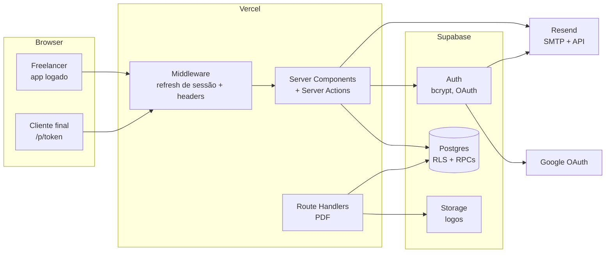

# 04 — Arquitetura

> Status: rascunho para validação · Última atualização: 2026-09-27 · Decisões em [decisoes/](decisoes/)

## Stack

| Camada | Escolha | ADR |
|---|---|---|
| Framework | Next.js (App Router, última estável) + React Server Components + Server Actions | 0001 |
| Linguagem / runtime | TypeScript `strict`, **Node 24 LTS**, **npm** | 0001 |
| UI | Tailwind CSS + shadcn/ui (Radix) + lucide-react | 0001 |
| Formulários / validação | React Hook Form + Zod (schemas compartilhados client/server) | 0001 |
| Banco / Auth / Storage | Supabase (Postgres, Auth, Storage) via `@supabase/supabase-js` + `@supabase/ssr` | 0001, 0002 |
| Acesso ao banco | `supabase-js` + tipos gerados, **sem ORM** | 0008 |
| Schema / migrações | Supabase CLI: schema declarativo + `db diff`; local no Docker, staging e prod na nuvem | 0008 |
| PDF | `@react-pdf/renderer` em Route Handler (runtime Node) | 0003 |
| E-mail transacional | Resend: SMTP do Supabase Auth + API no app para notificações (React Email) | 0002 |
| CAPTCHA | Cloudflare Turnstile no cadastro, validado pela Server Action (`siteverify`) | 0002 |
| Rate limit | Tabela + função no Postgres | 0004 |
| PWA | `app/manifest.ts` + service worker próprio (`public/sw.js`), sem cache offline | 0009 |
| Push | Web Push padrão: lib `web-push` + chaves VAPID, sem serviço externo | 0009 |
| Jobs agendados | Vercel Cron (1×/dia) → Route Handler protegido; `pg_cron` para manutenção no banco | 0009 |
| Tema | Tailwind `dark:` + `prefers-color-scheme` (segue o sistema) | 0001 |
| Testes | Vitest (unitário) + Playwright (E2E) | 0001 |
| Qualidade / segurança de código | ESLint, Prettier, GitHub Actions, CodeQL, Dependabot, secret scanning | 0007 |
| Hosting | Vercel (preview por PR e `main` = staging; produção em orco.nbbrdev.com só via release) | 0001, 0010 |
| Versionamento / releases | SemVer + Conventional Commits + release-please; deploy de produção por tag com a Vercel CLI no Actions | 0010 |

**Fora por ora:** Sentry, Upstash, magic link, MFA (reavaliar em M7).

## Visão geral



## Estrutura de pastas (prevista)

```
/
├── docs/                      documentação (fonte da verdade de conteúdo)
├── supabase/
│   ├── schemas/               estado declarativo do banco (tabelas, RLS, funções)
│   ├── migrations/            SQL versionado, gerado por `db diff` e revisado
│   ├── seed.sql               dados fictícios de desenvolvimento
│   └── config.toml
├── src/
│   ├── app/
│   │   ├── (marketing)/       /, /termos, /privacidade
│   │   ├── (auth)/            /entrar, /cadastro, /recuperar-senha, /redefinir-senha
│   │   ├── auth/callback/     route handler OAuth/confirmação
│   │   ├── app/               área logada (layout com navegação)
│   │   │   ├── orcamentos/
│   │   │   ├── clientes/
│   │   │   ├── catalogo/
│   │   │   └── perfil/
│   │   ├── p/[token]/         página pública do orçamento
│   │   └── api/               route handlers de PDF
│   ├── components/
│   │   ├── ui/                shadcn/ui (gerado)
│   │   └── ...                componentes do produto
│   ├── features/              lógica por domínio: quotes/, clients/, catalog/, profile/
│   │   └── <feature>/         actions.ts, queries.ts, schemas.ts (Zod), components/
│   ├── lib/
│   │   ├── supabase/          server.ts, client.ts, middleware.ts, admin.ts (server-only)
│   │   ├── money.ts           centavos ↔ BRL, cálculo (RN-15–RN-18)
│   │   ├── notify.ts          e-mail + push ao freelancer (ADR-0009)
│   │   ├── whatsapp.ts        buildWhatsAppLink (click-to-chat)
│   │   └── dates.ts           fuso America/Sao_Paulo
│   ├── pdf/                   templates react-pdf
│   └── types/database.ts      gerado pelo Supabase CLI
├── tests/
│   ├── unit/                  Vitest
│   └── e2e/                   Playwright
├── .github/                   workflows, dependabot, templates (M1)
└── CLAUDE.md
```

## Padrões de fluxo

**Leitura (área logada):** Server Component → client Supabase **server** (cookies do usuário) → a query passa pela RLS → renderiza. Nunca há fetch de dados sensíveis no client sem RLS.

**Mutação:** formulário (RHF + Zod no client, só para UX) → **Server Action** → revalida com o mesmo schema Zod → `getUser()` → query com o client do usuário (RLS) → `revalidatePath`/retorno para a UI otimista.

**Salvamento automático:** debounce (~800 ms) no editor → Server Action `saveQuoteDraft` → responde com a versão e o horário salvo. O conflito entre abas é resolvido por "última escrita vence" no MVP.

**Página pública `/p/[token]` (ADR-0005):** Server Component → rate limit → client **admin** (`src/lib/supabase/admin.ts`, `server-only`) → RPC `get_public_quote(token)` (`SECURITY DEFINER`, retorna campos mínimos) → renderiza. O navegador do cliente final nunca fala com o Supabase. A resposta chama a RPC `respond_to_quote` via Server Action. Rate limit via RPC `check_rate_limit`. Depois do commit da resposta, a Server Action chama `notifyFreelancer` (e-mail + push) em `after()` do Next.js, para não atrasar a página do cliente. Uma falha no envio é logada sem PII e não afeta a resposta (RN-42).

**PDF:** Route Handler (runtime Node) → autentica (dono via sessão; cliente via token) → rate limit → busca os dados → `renderToBuffer` do react-pdf → `Content-Disposition: attachment` (download) ou `inline` (prévia do freelancer, RN-22a, que não muda o status).

**Cálculo de totais:** uma única implementação em `src/lib/money.ts`, usada no client (tempo real), no servidor (persistência) e no PDF. O total é sempre recalculado no servidor, nunca confiado do client.

**Notificações (ADR-0009):** um módulo `src/lib/notify.ts` com `notifyFreelancer(userId, event)` centraliza tudo: lê as preferências (`email_notifications`, assinaturas push), envia o e-mail (Resend) e o push (`web-push`) em paralelo, apaga assinaturas expiradas (404/410) e nunca lança erro para quem chamou (RN-42). É chamado em `after()` na resposta do cliente, na 1ª visualização e no cron de lembretes.

**Lembrete diário:** Vercel Cron (`vercel.json`, ex.: 12:00 UTC = 9h em São Paulo) → `GET /api/cron/lembretes` com `Authorization: Bearer $CRON_SECRET` → RPC `quotes_due_for_reminder()` → `notifyFreelancer` → marca `reminder_sent_at`.

**Status `expirado`:** derivado na leitura (`status = 'sent' AND valid_until < hoje_SP`), exposto por uma view/função. Não depende de cron.

## Convenções de nomes

- Código, banco, tipos e identificadores em **inglês** (`quotes`, `valid_until`, `approved`).
- Tudo que o usuário vê em **pt-BR**: textos, **URLs** (`/app/orcamentos`), nomes de arquivo de PDF.
- Mapeamento de status em [11-mapa.md](11-mapa.md).
