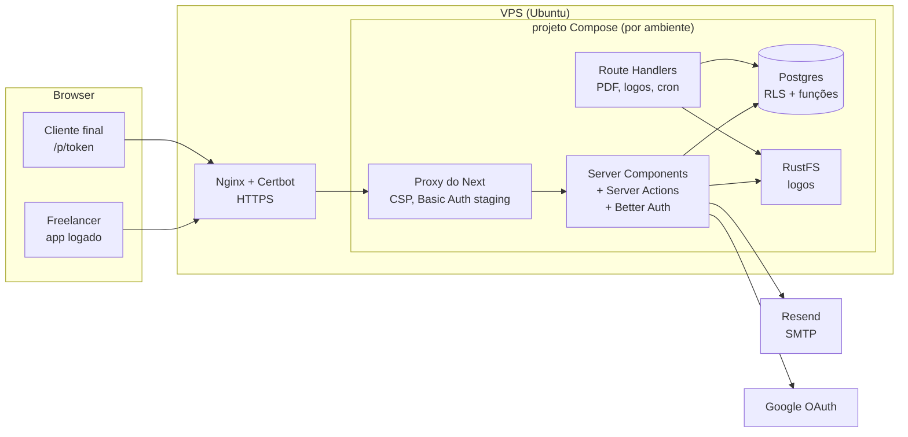

# 04 — Arquitetura

> Status: rascunho para validação · Última atualização: 2026-09-29 · Decisões em [decisoes/](decisoes/)
>
> **2026-09-29:** arquitetura redefinida para **VPS própria com Postgres**, sem Supabase e sem Vercel (ADR-0012 a 0016).

## Stack

| Camada | Escolha | ADR |
|---|---|---|
| Framework | **Next.js 16** (App Router, Turbopack, React Compiler ligado) + React 19 Server Components + Server Actions. No Next 16 o antigo `middleware.ts` chama-se **`proxy.ts`** | 0001 |
| Linguagem / runtime | TypeScript `strict`, **Node 24 LTS**, **npm** | 0001 |
| UI | Tailwind CSS 4 + shadcn/ui (base Radix, preset Nova, pacote `cn`) + lucide-react; tokens do doc 12 em `src/app/globals.css`. Arrastar para reordenar os itens: `@dnd-kit` (NBB-86). Campos que buscam enquanto se digita (cliente e catálogo no editor): Combobox do shadcn, com `cmdk` (NBB-87) | 0001 |
| Formulários / validação | React Hook Form + Zod (schemas compartilhados client/server) | 0001 |
| Banco | **PostgreSQL 17** próprio, um por ambiente (container) | 0014 |
| Acesso ao banco / migrações | **Drizzle** (schema em TS, consultas tipadas) + `drizzle-kit` (migrations SQL revisadas) | 0014 |
| Autorização | **RLS** em todas as tabelas do produto, com as roles `orco_owner` (migrations), `app_auth` (login) e `app_user` (produto); `withUserDb(userId, fn)` | 0014 |
| Autenticação | **Better Auth** (e-mail + senha, confirmação, recuperação, Google; sessões no Postgres) | 0013 |
| Arquivos | **RustFS** (compatível com S3) via `@aws-sdk/client-s3` | 0015 |
| PDF | `@react-pdf/renderer` em Route Handler (runtime Node) | 0003 |
| E-mail transacional | **Nodemailer + SMTP**: Mailpit local, Resend em staging/produção | 0016 |
| Anti-abuso do cadastro | Sem CAPTCHA externo: limite por IP, honeypot e teto diário de e-mails, validados pela Server Action (RN-46) | 0002 |
| Rate limit | Tabela + função no Postgres | 0004 |
| PWA | `app/manifest.ts` + service worker próprio (`public/sw.js`), sem cache offline | 0009 |
| Push | Web Push padrão: lib `web-push` + chaves VAPID, sem serviço externo | 0009 |
| Jobs agendados | Agendamento na VPS (cron do sistema ou container) → Route Handler protegido por `CRON_SECRET` | 0009, 0012 |
| Tema | **next-themes** (classe `.dark` no `<html>`, escolha salva no navegador) + Tailwind `dark:`. Padrão "Automático" (segue o sistema); o usuário pode fixar Claro ou Escuro no perfil | 0001 |
| Testes | Vitest (unitário) + Playwright (E2E) | 0001 |
| Qualidade / segurança de código | ESLint, Prettier, GitHub Actions, CodeQL, Dependabot, secret scanning | 0007 |
| Hosting | **VPS Hostinger** (Ubuntu) com **Docker Compose** (app + Postgres + RustFS por ambiente), **Nginx + Certbot** no Ubuntu; imagens no **GHCR**; deploy por SSH a partir do GitHub Actions (`main` = staging; produção só via release; sem preview por PR) | 0012 |
| Versionamento / releases | SemVer escolhido pelo usuário; tag `vX.Y.Z` via `gh release create` → `production.yml` (verify → build → migrate → deploy) | 0010 |

**Fora por ora:** Sentry, Upstash, magic link, MFA (reavaliar em M7). O Sentry foi reavaliado na NBB-57 (2026-10-04) e continua fora: os erros ficam nos logs do Docker.

## Visão geral



## Estrutura de pastas (prevista)

```
/
├── docs/                      documentação (fonte da verdade de conteúdo)
├── db/
│   └── migrations/            SQL gerado pelo drizzle-kit e revisado (roles, tabelas, RLS, funções)
├── deploy/                    compose.yaml, deploy.sh, nginx/orco.nbbrdev.com.conf, env.example, README (o Orçô na VPS; a base fica no nbbrdev/vps)
├── Dockerfile                 imagem do app (standalone, não-root)
├── compose.dev.yaml           local: Postgres, RustFS e Mailpit
├── src/
│   ├── app/
│   │   ├── (marketing)/       /, /termos, /privacidade
│   │   ├── (auth)/            /entrar, /cadastro, /recuperar-senha, /redefinir-senha
│   │   ├── api/auth/[...all]/ rotas do Better Auth (confirmação de e-mail, callback do Google)
│   │   ├── app/               área logada (layout com navegação)
│   │   │   ├── orcamentos/
│   │   │   ├── clientes/
│   │   │   ├── catalogo/
│   │   │   └── perfil/
│   │   ├── p/[token]/         página pública do orçamento
│   │   └── api/               route handlers de PDF
│   ├── components/
│   │   ├── ui/                shadcn/ui (gerado)
│   │   └── ...                componentes do produto
│   ├── features/              lógica por domínio: quotes/, clients/, catalog/, profile/
│   │   └── <feature>/         actions.ts, queries.ts, schemas.ts (Zod), components/
│   ├── lib/
│   │   ├── db/                schema Drizzle, clients app_user/app_auth, withUserDb (server-only)
│   │   ├── auth/              configuração do Better Auth e helpers de sessão (server-only)
│   │   ├── email/             Nodemailer + templates pt-BR (server-only)
│   │   ├── storage/           cliente S3 do RustFS (server-only)
│   │   ├── money.ts           centavos ↔ BRL, cálculo (RN-15–RN-18)
│   │   ├── notify.ts          e-mail + push ao freelancer (ADR-0009)
│   │   ├── whatsapp.ts        buildWhatsAppLink (click-to-chat)
│   │   └── dates.ts           fuso America/Sao_Paulo
│   ├── proxy.ts               Proxy do Next 16 (antigo middleware): CSP, Basic Auth do staging
│   └── pdf/                   templates react-pdf
├── tests/                     como rodar: docs/06-regras-dev.md §7
│   ├── unit/                  Vitest, sem banco
│   ├── integration/           Vitest contra Postgres real (RLS)
│   ├── stubs/                 substitutos de módulos só do Next (ex.: server-only)
│   └── e2e/                   Playwright (desde a NBB-39/72)
├── .github/                   workflows, dependabot, templates (M1)
└── CLAUDE.md
```

## Padrões de fluxo

**Leitura (área logada):** Server Component → valida a sessão (Better Auth, no servidor) → `withUserDb(userId, …)` → a query passa pela RLS (role `app_user`) → renderiza. O navegador nunca fala com o banco.

**Mutação:** formulário (RHF + Zod no client, só para UX) → **Server Action** → revalida com o mesmo schema Zod → sessão validada → `withUserDb(userId, …)` (RLS) → `revalidatePath`/retorno para a UI otimista.

**Salvamento automático:** debounce (~800 ms) no editor → Server Action `saveQuoteDraft` → responde com a versão e o horário salvo. O conflito entre abas é resolvido por "última escrita vence" no MVP.

**Página pública `/p/[token]` (ADR-0005/0014):** Server Component → rate limit → função `get_public_quote(token)` (`SECURITY DEFINER`, executada pela role `app_user`, retorna campos mínimos) → renderiza. O navegador do cliente final nunca fala com o banco. A resposta chama a função `respond_to_quote` via Server Action. Rate limit via função `check_rate_limit`. Depois do commit da resposta, a Server Action chama `notifyFreelancer` (e-mail + push) em `after()` do Next.js, para não atrasar a página do cliente. Uma falha no envio é logada sem PII e não afeta a resposta (RN-42).

**PDF:** Route Handler (runtime Node) → autentica (dono via sessão; cliente via token) → rate limit → busca os dados → `renderToBuffer` do react-pdf → `Content-Disposition: attachment` (download) ou `inline` (prévia do freelancer, RN-22a, que não muda o status).
- **O modelo** (NBB-50, 2026-10-03) fica em `src/pdf/`: `model.ts` monta os textos e as regras de exibição (RN-04, RN-15b), como função pura e testada; `quote-document.tsx` desenha; `render.ts` gera o arquivo.
- **Fonte:** Inter do pacote `@fontsource/inter` (.woff, pesos 400, 600 e 700), sem fonte binária no repositório.
- **Logo:** fica guardado em WebP (RN-05), mas o react-pdf só lê PNG e JPEG; na hora do PDF, o servidor converte para PNG com o `sharp` (`logo.ts`).
- **Revisar o visual:** `npm run pdf:sample` grava PDFs de exemplo, com dados inventados, em `pdf-samples/` (ignorada pelo Git).
- **Rota do dono** (NBB-51, 2026-10-04): `GET /api/orcamentos/[id]/pdf` é a prévia (`inline`, não muda o status, RN-22a), aberta numa aba nova pelo **Visualizar** do editor. `POST` na mesma rota é o download (`attachment`) do **Baixar PDF**, que antes envia o rascunho (RN-22; o banco confere a RN-13). É `POST` porque muda o status: um `GET` poderia ser disparado por pré-carregamento ou por um link de outro site. A regra fica em `src/features/quotes/pdf.ts`, e a rota é uma casca fina. O limite é de 20 PDFs por minuto por conta (RN-39). O PDF público, por token, fica para a M6.
- **Fonte na imagem Docker:** o `next.config.ts` leva para o `.next/standalone` só os três arquivos da Inter usados (`outputFileTracingIncludes`/`Excludes`), em vez da pasta inteira do pacote (4,6 MB).

**Cálculo de totais:** uma única implementação em `src/lib/money.ts`, usada no client (tempo real), no servidor (persistência) e no PDF. O total é sempre recalculado no servidor, nunca confiado do client.

**Notificações (ADR-0009):** um módulo `src/lib/notify.ts` com `notifyFreelancer(userId, event)` centraliza tudo: lê as preferências (`email_notifications`, assinaturas push), envia o e-mail (módulo SMTP, ADR-0016) e o push (`web-push`) em paralelo, apaga assinaturas expiradas (404/410) e nunca lança erro para quem chamou (RN-42). É chamado em `after()` na resposta do cliente, na 1ª visualização e no cron de lembretes.

- **Como ficou na NBB-55** (2026-10-04): `notifyFreelancer(target, event)` recebe o destinatário já pronto (`target`: e-mail da conta e `email_notifications`), porque na resposta do cliente não há sessão do freelancer, e o app só lê os dados de uma conta pela sessão dela. Quem entrega o `target` é a própria `respond_to_quote` (E1-A), só na resposta registrada. O e-mail é o modelo `src/lib/email/templates/quote-response.ts`. Uma falha vai para o log só com o id do orçamento e o código do erro, sem o e-mail (E5). O push entra na NBB-61, e o lembrete, na NBB-62.
- **Como ficou na NBB-61** (2026-10-04): o `target` ganhou as assinaturas de push da conta, e o `notifyFreelancer` manda e-mail e push em paralelo, cada um com a sua preferência (o push vai para os aparelhos que ligaram as notificações). O envio fica em `src/lib/push.ts` (`web-push`, chaves VAPID lidas na hora), e o texto do aviso em `src/features/push/messages.ts`. Na primeira visualização do link, a `register_quote_view` entrega o mesmo tipo de aviso (só push), e a página o manda em `after()`.

**Lembrete diário:** agendamento na VPS (ex.: 9h em São Paulo) → `GET /api/cron/lembretes` com `Authorization: Bearer $CRON_SECRET` → função `quotes_due_for_reminder()` → `notifyFreelancer` → marca `reminder_sent_at`.

- **Como ficou** (NBB-62, 2026-10-04): o cron do sistema da VPS (`/etc/cron.d/orco`, modelo em `deploy/orco.cron`) roda o `deploy/daily.sh` todo dia às 12h UTC (9h de São Paulo), um ambiente de cada vez. O script faz `POST /api/cron/diario` pela porta local do app, com a `CRON_SECRET` do `.env`. A rota faz as duas tarefas do dia (L2-A): o lembrete (a função `app.claim_due_reminders()` pega os orçamentos e marca o `reminder_sent_at` numa só operação, então rodar duas vezes não duplica; depois, `notifyFreelancer` por e-mail e push) e a anonimização dos IPs antigos (RN-37). Responde 503 sem a `CRON_SECRET` configurada e 401 sem a senha certa. Fica fora do Basic Auth do staging, porque tem a própria senha.

**Status `expirado`:** derivado na leitura (`status = 'sent' AND valid_until < hoje_SP`), exposto por uma view/função. Não depende de cron.

## Convenções de nomes

- Código, banco, tipos e identificadores em **inglês** (`quotes`, `valid_until`, `approved`).
- Tudo que o usuário vê em **pt-BR**: textos, **URLs** (`/app/orcamentos`), nomes de arquivo de PDF.
- Mapeamento de status em [11-mapa.md](11-mapa.md).
