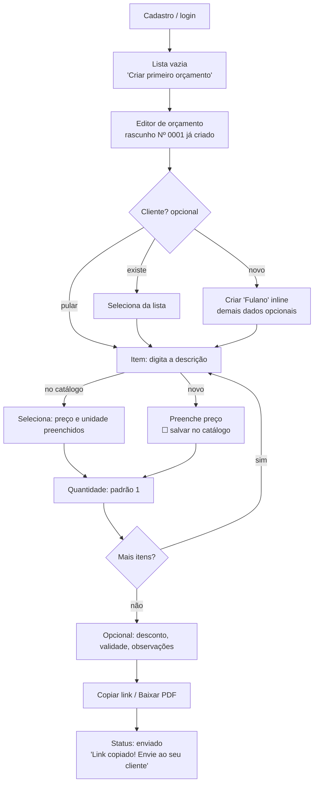
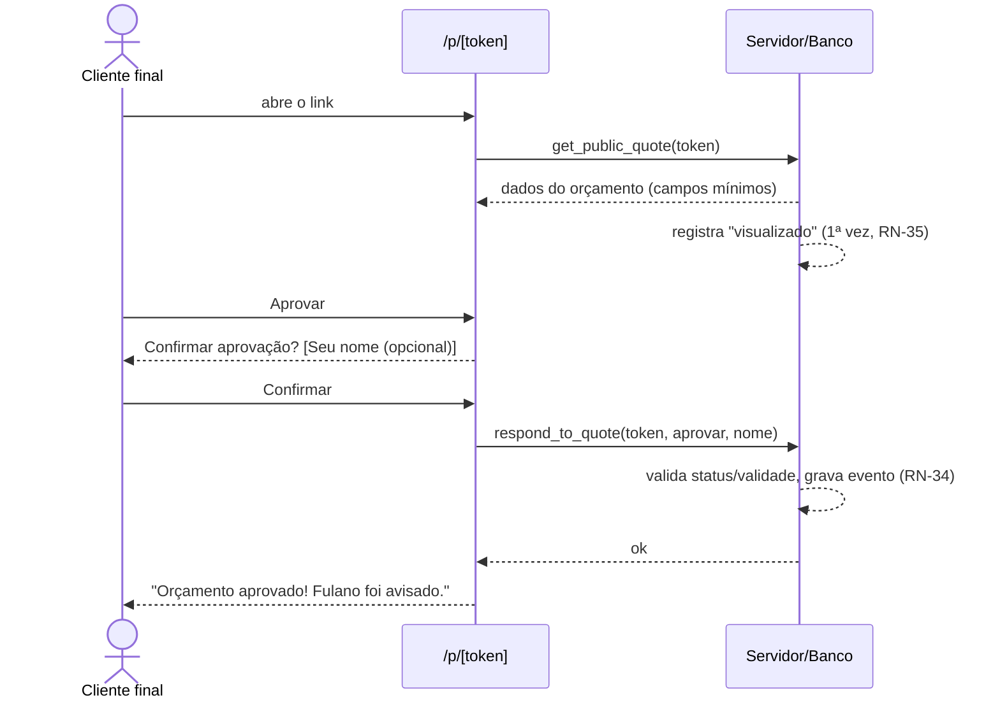

# 10 — Fluxos

> Status: **✅ todos os fluxos validados pelo usuário em 2026-09-27.** Fluxos novos entram como `⏳` até serem aprovados.
> Última atualização: 2026-09-27
>
> **Portão da M0:** o desenvolvimento (M1) só começa quando todos os fluxos estiverem `✅`. Cumprido.
>
> Cada fluxo tem um **orçamento de simplicidade**: o máximo de telas, toques e campos obrigatórios. Uma implementação que estoure esse orçamento é considerada bug de UX.

## Índice

| # | Fluxo | Ator | Status |
|---|---|---|---|
| F-01 | Cadastro com e-mail e senha | Freelancer | ✅ |
| F-02 | Entrar/cadastrar com Google | Freelancer | ✅ |
| F-03 | Entrar com e-mail e senha | Freelancer | ✅ |
| F-04 | Recuperar senha | Freelancer | ✅ |
| F-05 | **Primeiro orçamento (fluxo principal)** | Freelancer | ✅ |
| F-06 | Compartilhar orçamento (link / PDF) | Freelancer | ✅ |
| F-07 | Cliente aprova | Cliente final | ✅ |
| F-08 | Cliente recusa | Cliente final | ✅ |
| F-09 | Acompanhar orçamentos | Freelancer | ✅ |
| F-10 | Editar orçamento enviado | Freelancer | ✅ |
| F-11 | Expiração e prorrogação | Sistema / Freelancer | ✅ |
| F-12 | Duplicar orçamento | Freelancer | ✅ |
| F-13 | Excluir orçamento / regenerar link | Freelancer | ✅ |
| F-14 | Completar perfil | Freelancer | ✅ |
| F-15 | Gerenciar clientes | Freelancer | ✅ |
| F-16 | Gerenciar catálogo | Freelancer | ✅ |
| F-17 | Excluir conta | Freelancer | ✅ |
| F-18 | Ativar notificações push e instalar o app | Freelancer | ✅ |

---

## F-01 — Cadastro com e-mail e senha · ✅

**Orçamento de simplicidade:** 2 campos obrigatórios · 1 tela + 1 e-mail.

1. Landing `/` → **Começar grátis** → `/cadastro`.
2. Informa e-mail e senha (RN-03), com o requisito da senha visível enquanto digita. A proteção contra robôs (RN-46) não aparece para a pessoa.
3. **Criar conta** → a tela mostra "Se este e-mail puder ser usado, enviamos um link para *email*. Abra-o para ativar sua conta." com botão **Reenviar**. É a **mesma resposta** para conta nova, e-mail já cadastrado e robô (honeypot), para não revelar quais contas existem (decidido em 2026-10-02, NBB-39).
4. Abre o e-mail (remetente Orçô, domínio próprio) → clica no link → rota de confirmação do Better Auth (`/api/auth/verify-email`; o servidor confere o token de uso único, válido por 1 hora; funciona mesmo se o e-mail for aberto em outro aparelho) → já entra logado em `/app/orcamentos`, que está vazia e mostra o botão grande **Criar primeiro orçamento** (F-09).

**Erros:**
- E-mail já cadastrado: a mesma resposta do passo 3.
- Senha fraca: validação inline, antes do envio.
- Link expirado ou já usado: vai para `/entrar` com o aviso "Este link expirou ou já foi usado"; ao entrar com a conta ainda não confirmada, a tela oferece **Reenviar** (F-03).
- **Reenviar** também tem limite (RN-46): 3 por hora por IP e conta no teto diário de e-mails.
- Muitos cadastros do mesmo IP (RN-46): "Muitas tentativas. Tente de novo em alguns minutos."
- Teto diário de e-mails atingido (RN-46): "Estamos com muitos cadastros hoje. Tente amanhã ou use **Continuar com Google**." (F-02 continua disponível).
- Campo "isca" preenchido (robô): mostra a mesma tela do passo 3, sem criar conta nem enviar e-mail.

## F-02 — Entrar/cadastrar com Google · ✅

**Orçamento:** 0 campos · 1 toque + tela do Google.

1. `/entrar` ou `/cadastro` → **Continuar com Google** (no topo, acima do formulário de e-mail, separado por "ou").
2. Consentimento no Google → `/api/auth/callback/google` (rota do Better Auth).
3. Sempre vai para `/app/orcamentos`. No primeiro acesso, a lista vazia mostra **Criar primeiro orçamento**, igual ao F-01.

**Erros** (decididos em 2026-10-02, NBB-40; todos voltam a `/entrar`):
- O usuário cancelou no Google → "Login cancelado."
- O e-mail já tem conta por senha **confirmada** → o Better Auth vincula as identidades (e-mail verificado nos dois lados) e a pessoa entra.
- O e-mail tem conta por senha **ainda não confirmada** → não vincula, para ninguém tomar a conta de outra pessoa cadastrando o e-mail dela antes: "Este e-mail já tem uma conta esperando confirmação. Abra o link que enviamos (ou entre e peça um novo) e depois use o Google."
- Qualquer outra falha → "Não foi possível entrar com o Google. Tente de novo."

## F-03 — Entrar com e-mail e senha · ✅

**Orçamento:** 2 campos · 1 tela.

1. `/entrar` → e-mail + senha → **Entrar** → `/app/orcamentos`.

**Erros:** credenciais inválidas → "E-mail ou senha incorretos" (sem dizer qual). E-mail não confirmado → "Confirme seu e-mail" + **Reenviar**. Excesso de tentativas → "Muitas tentativas. Tente em alguns minutos."

A sessão persiste no navegador até o logout; não existe "lembrar de mim".

## F-04 — Recuperar senha · ✅

1. `/entrar` → **Esqueci minha senha** → `/recuperar-senha` → e-mail → **Enviar**.
2. A resposta é sempre "Se existir uma conta, enviamos um link".
3. Link do e-mail (vale 1 hora, uso único) → `/redefinir-senha` → nova senha (1 campo, com o botão do olho e a dica "mínimo 8 caracteres") → **Salvar** → `/entrar` com o aviso "Senha alterada. Entre com a nova senha." (NBB-41, 2026-10-02: o Better Auth não faz login nesse passo).
4. A conta recebe o e-mail **"Sua senha foi alterada"**, com o botão "Não fui eu: redefinir senha". O mesmo aviso sai em qualquer troca de senha (segurança, 2026-09-28).
5. Todas as sessões da conta são encerradas: é preciso entrar de novo em cada aparelho.

**Erros:** link vencido ou já usado → `/recuperar-senha` com "Este link expirou ou já foi usado. Peça um novo." Excesso de pedidos (3 por hora por IP) → "Muitas tentativas. Tente de novo em alguns minutos."

## F-05 — Primeiro orçamento (fluxo principal) · ✅

**Meta: < 2 minutos do cadastro ao link copiado.**
**Orçamento de simplicidade:** 1 tela (editor) · 2 campos obrigatórios (descrição e preço do item; a quantidade já vem 1) · cliente opcional · nenhum pré-cadastro necessário.



**Layout do editor (celular):**
```
Orçamento Nº 0001        Salvo ✓

Cliente  [ Maria Silva      ]

Itens
  Logo           1 × 800,00
  Site           1 × 2.000,00
  + Adicionar item

▸ Mais opções (desconto, validade, pagamento, prazo, observações, anotações)

──────────────────────────────
Total R$ 2.800,00  [Visualizar] [Compartilhar]
```
- A tela mostra só cliente, itens e total. Desconto geral, validade, condições de pagamento, prazo de execução, observações e anotações internas ficam recolhidos em **Mais opções**, já preenchidos com os padrões do perfil (RN-44).
- Rodapé fixo com o total e as ações.

**Detalhes:**
- O editor abre com número, validade padrão (RN-19) e observações padrão do perfil já preenchidos.
- Item novo digitado no editor: **Salvar no catálogo** fica no menu **⋯** do item, e não numa caixinha no cartão (decidido em 2026-10-03, NBB-87 C7-B: o cartão fica mais limpo no celular, e continua sendo um toque).
- Total, subtotal e desconto são recalculados a cada digitação (RN-15 a RN-18).
- Salvamento automático com indicador discreto "Salvo" (RN-21).
- **Como ficou a parte 1 do editor** (NBB-86, 2026-10-03):
  - **Novo orçamento** é um botão (formulário), não um link: só um toque de verdade cria o rascunho, e o editor abre em `/app/orcamentos/<id>` com um item vazio, quantidade 1. No limite do mês (RN-38), volta para a lista com "Você chegou ao limite de 200 orçamentos neste mês. O limite volta no dia 1º.".
  - Cada item é um cartão editável: descrição; quantidade e valor lado a lado; total da linha. O menu **⋯** do item tem **Remover**, sem confirmação.
  - **Reordenar:** arrastando o item pela alça (⠿); pelo teclado, espaço, setas e espaço.
  - Salva o orçamento inteiro ~800 ms depois da última mudança ("Salvando…" / "Salvo ✓"). Campo inválido fica destacado e nada é salvo até corrigir ("Corrija os campos destacados para salvar").
  - Rodapé fixo só com o total; **Visualizar** e **Compartilhar** chegam com o PDF e o envio (M5/M6). No limite de 100 itens, "Este orçamento chegou ao limite de 100 itens." e o **Adicionar item** some.
- **Como ficou a parte 2 do editor** (NBB-87, 2026-10-03):
  - **Cliente:** o campo **Escolher cliente (opcional)** busca entre os clientes enquanto se digita (sem acentos) e oferece **Criar "Fulano"** no fim, que cria o cliente só com o nome (RN-07) e já o escolhe. Escolhido, aparecem o nome e os contatos, com **Trocar** e **×** (tirar). O orçamento guarda uma cópia dos dados (RN-20), salva na hora.
  - **Unidade:** um campo pequeno entre a quantidade e o valor ("1 [h] × 800,00").
  - **Catálogo:** ao digitar a descrição, aparecem sugestões do catálogo; escolher uma preenche descrição, unidade e valor, e o item guarda de onde veio (RN-11). **Salvar no catálogo**, no menu **⋯**, cria o item no catálogo e liga a linha a ele (some do menu depois).
- **Como ficou a parte 3 do editor** (NBB-88, 2026-10-03):
  - **Desconto do item** (RN-15a): **Adicionar desconto**, no menu **⋯**, abre uma linha embaixo do item, com **%** ou **R$**, o valor e um **×** para tirar. O foco vai direto para o campo. O total da linha mostra o desconto: "R$ 720,00 (−10%)".
  - **Mais opções:** fica fechado, abaixo dos itens. Tem desconto geral (% ou R$), validade, condições de pagamento, prazo de execução, observações ("O cliente vê.") e anotações internas ("Só você vê."), já com os padrões do perfil. Abre sozinho se algum campo dele precisar de correção.
  - Tudo entra no mesmo salvamento automático, e o servidor recalcula os totais com o `money.ts`.
  - **Rodapé:** com desconto geral, uma linha menor acima do total: "Subtotal R$ 2.720,00 · Desconto −R$ 220,00".
  - **Validade:** o seletor de data do aparelho, obrigatória. Uma data no passado é aceita, com o aviso "Essa data já passou: o orçamento vai aparecer como expirado.".
  - **Desconto maior que o valor:** é aceito e limitado à base (RN-15a, RN-17), com o aviso "O desconto ficou limitado ao valor.".
- Se faltar algo exigido pela RN-13 ao tentar compartilhar, o campo faltante é destacado com uma mensagem direta, ex.: "Informe o valor do item 2 para enviar".
- Na primeira vez, se o perfil estiver vazio, aparece uma dica **não bloqueante**: "Adicione seu nome e logo para o orçamento ficar com a sua cara →".
- Perto do botão de compartilhar, um atalho **Compartilhar no WhatsApp** abre `wa.me` com o link. Não é envio automático: é o próprio app do usuário que abre.

## F-06 — Compartilhar orçamento · ✅

**Orçamento:** 1 toque.

- **Visualizar** → abre a prévia do PDF na tela (modal/tela cheia no celular), exatamente como o cliente vai receber. **Não muda o status** (RN-22a). A prévia tem atalhos para Copiar link / Baixar PDF / WhatsApp.
- **Copiar link** → copia `https://orco.nbbrdev.com/p/<token>` e mostra "Link copiado".
- **Baixar PDF** → gera o PDF no servidor e baixa como `Orcamento-0001-Cliente.pdf`.
- **WhatsApp** → link *click-to-chat* com a mensagem "Olá! Segue o orçamento Nº 0001: <link>" já escrita. Quem envia é o próprio freelancer, pelo WhatsApp dele; **não há API nem envio pelo sistema**.
  - Se o cliente do orçamento tem telefone: `wa.me/55DDDNUMERO?text=…` abre direto a conversa com ele. O telefone é normalizado para só dígitos, com `55` acrescentado quando tiver 10–11 dígitos.
  - Sem telefone: `wa.me/?text=…` e o freelancer escolhe o contato.
  - No celular abre o app; no computador, o WhatsApp Web/Desktop.
- Em qualquer um dos três, se o orçamento for `rascunho` e cumprir a RN-13, passa a `enviado` (RN-22).
- No **primeiro** envio da conta, logo depois do feedback "Link copiado", aparece o convite de notificações push (F-18).

## F-07 — Cliente aprova · ✅

**Orçamento:** 0 campos obrigatórios · 2 toques (Aprovar → Confirmar).



A página mostra: logo e nome do freelancer, número, data, validade, cliente (se houver), itens, totais, condições de pagamento e prazo de execução (se houver), observações, dados de pagamento, **Baixar PDF**, **Aprovar**, **Recusar**, e os contatos do freelancer (telefone, e-mail, site, Instagram, se houver).

```
[logo] Estúdio Fulano · (11) 9…  · @fulano
Orçamento Nº 0001 · emitido 27/09 · válido até 12/10
Para: Maria Silva
Logo ............ 1 × 800,00 ... 720,00 (−10%)
Site ............ 1 × 2.000,00 . 2.000,00
Subtotal 2.720,00 · Desconto −220,00 · TOTAL R$ 2.500,00
Condições: 50% entrada, 50% entrega · Prazo: 15 dias úteis
Observações · Pagamento: Pix chave…
[Baixar PDF]   [ Recusar ]  [ ✓ Aprovar ]
```

Depois de aprovar, a confirmação mostra o botão **Falar com Fulano no WhatsApp** (`wa.me/<telefone do perfil>`), **só se** o freelancer tiver telefone no perfil.

**Erros:**
- Token inválido, rascunho ou excluído: página genérica "Orçamento não encontrado" (RN-31).
- Orçamento expirado: sem botões, com "Este orçamento venceu em dd/mm. Fale com *freelancer* para renovar."
- Orçamento já respondido: mostra o resultado e a data.
- Limite de requisições: "Muitas tentativas, aguarde um instante."

> "Fulano foi avisado": o freelancer recebe e-mail (RN-40) e/ou push (RN-45) e vê o destaque "novo" na lista.

## F-08 — Cliente recusa · ✅

Igual ao F-07, mas com **Recusar** → "Quer dizer o motivo?" (opcional), com chips rápidos **Preço · Prazo · Desisti · Outro** e/ou texto livre → **Confirmar recusa** → "Orçamento recusado. Fulano foi avisado." O e-mail ao freelancer (RN-40) inclui o motivo.

## F-09 — Acompanhar orçamentos · ✅

- `/app/orcamentos` é a tela inicial: cartões com número, cliente, total, status (com cor), "visualizado em…" e o selo **novo** para respostas ainda não vistas.
- Ordem padrão: **última atividade** (edição ou resposta mais recente primeiro).
- Sem resumo ou contadores no topo (relatórios estão fora do MVP).
- Filtros por status em abas: Todos · Rascunhos · Enviados · Aprovados · Recusados · Expirados.
- Busca por cliente ou número.
- Estado vazio: "Você ainda não tem orçamentos" + botão grande **Criar primeiro orçamento**.
- **Como ficou** (NBB-48, 2026-10-03):
  - a aba e a busca ficam na URL (`?status=enviados&busca=maria`), e o "voltar" do navegador mantém o filtro; o servidor traz 50 por vez, com **Mostrar mais**;
  - o cartão mostra "Nº 0001 · Maria Silva" (ou "Sem cliente"), o total, o status, o selo **Novo** e "Visualizado em dd/mm"; tocar abre o orçamento, e abrir um respondido tira o selo **Novo**;
  - "última atividade" é o `updated_at` do orçamento, que não muda com visualizações do cliente nem ao ver a resposta;
  - as abas ficam numa fileira que rola para o lado no celular, sem contadores; **Enviados** mostra só os que estão dentro da validade, e **Expirados**, os vencidos (RN-26);
  - a busca procura o número exato quando o texto é só dígitos ("12" encontra o Nº 0012); senão, procura no nome do cliente, sem diferenciar acentos nem maiúsculas;
  - lista vazia: "Nenhum orçamento enviado." (e assim por aba); busca sem resultado: "Nenhum orçamento encontrado para "maria".".

## F-10 — Editar orçamento enviado · ✅

- Mesmo editor. Um aviso discreto informa: "Este orçamento já foi enviado. O cliente verá as alterações ao abrir o link."
- Cada alteração salva incrementa a versão (RN-24).
- Depois da primeira alteração salva, o aviso muda para **"Orçamento atualizado · [Avisar cliente no WhatsApp]"**. O botão abre o WhatsApp (mesma regra de telefone do F-06) com "Olá! Atualizei o orçamento Nº 0001: <link>". Não muda o status, que já é enviado.
- Aprovados e recusados abrem em modo leitura com o botão **Duplicar para editar** (RN-25). Só as **anotações internas** continuam editáveis (RN-20a).

## F-11 — Expiração e prorrogação · ✅

- O status `expirado` é calculado automaticamente (RN-26).
- No orçamento expirado, o botão **Prorrogar validade** abre um seletor de data com a sugestão **hoje + validade padrão do perfil** (ex.: +15 dias). Ao salvar, o orçamento volta a `enviado` (RN-27) e o mesmo link continua valendo.

## F-12 — Duplicar orçamento · ✅

- Menu do orçamento → **Duplicar** → abre o editor com um novo rascunho (RN-28).

## F-13 — Excluir orçamento / regenerar link · ✅

- **Excluir**: menu → confirmação "Excluir o orçamento Nº 0001? O link deixará de funcionar." (RN-29).
- **Gerar novo link**: menu → confirmação "O link atual deixará de funcionar." → novo token (RN-36).

## F-14 — Completar perfil · ✅

`/app/perfil` é uma página única com seções:
```
[Prévia do cabeçalho do orçamento]
Sua marca ........ nome de exibição, nome comercial, logo (RN-05)
Contato .......... telefone, e-mail, site, Instagram, CPF/CNPJ
Pagamento ........ dados de pagamento, ex.: Pix (RN-04)
Padrões .......... validade (dias), observações, condições de pagamento, prazo de execução
Aparência ........ Tema: [Automático | Claro | Escuro] (padrão Automático; salvo neste aparelho, RNF-16)
Notificações ..... ☑ Notificações por e-mail (respostas e lembretes, RN-41)
                   ☐ Notificações push neste aparelho (RN-45)
                   [Instalar o Orçô no celular] (quando o navegador permitir)
Conta ............ sair · excluir minha conta (F-17)
Rodapé ........... "Orçô v0.4.0" · link "Novidades" (notas da versão no GitHub Releases)
```
- Tudo opcional, salvo automaticamente.
- **Salvamento:** cada campo se salva ao perder o foco, com "Salvando… / Salvo ✓" ao lado do nome e o erro embaixo do campo. O valor volta já limpo: site com `https://`, Instagram como `@usuario`, CPF/CNPJ formatado (NBB-42).
- **Máscaras** (NBB-84, aqui e nos clientes, F-15): telefone brasileiro com DDD, `(11) 91234-5678` ou `(11) 1234-5678`; CPF `000.000.000-00` até 11 caracteres e CNPJ `00.000.000/0000-00` a partir do 12º ou com letra (alfanumérico, em maiúsculas). Formatam enquanto se digita, sem tirar o cursor do lugar.
- **Logo** (NBB-81): no topo de "Sua marca", a miniatura com **Enviar logo** / **Trocar** e **Remover**. O navegador reduz a imagem antes de enviar; o logo aparece na prévia. Arquivo inválido: "Use uma imagem PNG, JPEG ou WebP de até 5 MB."
- **O que já existe** (NBB-42): prévia, Sua marca, Contato, Pagamento, Padrões, Notificações (só o e-mail), Conta (Sair e **Excluir minha conta**, NBB-43) e, no rodapé, a versão com o link **Novidades** (abre numa aba nova a página da versão no GitHub Releases; no staging e no local, a lista de versões). Chega depois: o push (issue de push).
- **Aparência** (NBB-60): três botões, **Automático / Claro / Escuro**. O tema vale na hora e fica salvo neste aparelho.
- **Instalar** (NBB-60), na seção Notificações:
  - Android e computador: o botão **Instalar o Orçô**, só quando o navegador oferece;
  - iPhone: a instrução "toque em Compartilhar e depois em Adicionar à Tela de Início";
  - já instalado: nada.

## F-15 — Gerenciar clientes · ✅

- Lista com busca. **Novo cliente** abre um painel lateral (bottom sheet no celular): só o nome é obrigatório (RN-07).
- Tocar num cliente abre a edição e a lista de orçamentos dele, com atalho **Novo orçamento para este cliente**.
- Ao editar um cliente usado em rascunhos, aparece a pergunta "Atualizar também os N rascunhos deste cliente?" (RN-20).
- Excluir pede confirmação e só é permitido se o cliente não tiver orçamentos. Caso tenha, a mensagem é "Este cliente tem N orçamentos. Exclua-os antes de excluir o cliente." (RN-09).
- **Implementado na NBB-44 (2026-10-03):**
  - a lista carrega todos os clientes, e a busca filtra na hora, por nome, e-mail ou CPF/CNPJ, sem diferenciar acentos nem maiúsculas;
  - o painel salva só ao tocar em **Salvar**;
  - telefone e CPF/CNPJ com as mesmas máscaras do perfil (NBB-84, F-14);
  - o **Excluir** fica no painel de edição e pede confirmação numa janela;
  - no limite de 1.000 clientes (RN-38), a mensagem é "Você chegou ao limite de 1.000 clientes. Exclua um cliente que não usa mais para cadastrar outro.".
- **Com os orçamentos** (NBB-46 e NBB-87, 2026-10-03):
  - o painel de edição do cliente mostra os orçamentos dele, do mais novo ao mais antigo (número, status e total; "Expirado" calculado pela data), e tocar abre o editor (RF-13);
  - **Novo orçamento para este cliente** cria o rascunho já com o cliente e abre o editor;
  - ao salvar um cliente usado em rascunhos, o painel fecha e aparece "Atualizar também os N rascunhos deste cliente?" (**Atualizar** / **Agora não**); só os rascunhos mudam (RN-20);
  - um cliente com orçamentos não pode ser excluído, com a mensagem da RN-09.

## F-16 — Gerenciar catálogo · ✅

- Lista com busca. **Novo item**: nome (obrigatório), preço e unidade (opcionais) (RN-10).
- Excluir não afeta orçamentos. Ao editar um item usado em rascunhos, aparece a pergunta "Atualizar também os N rascunhos que usam este item?" (RN-11).
- Estado vazio: "Itens que você usa sempre ficam aqui. Você também pode salvá-los direto do orçamento."
- **Implementado na NBB-45 (2026-10-03),** no mesmo padrão dos clientes (F-15):
  - busca pelo nome, sem diferenciar acentos nem maiúsculas;
  - painel com **Salvar** e **Excluir** com confirmação;
  - o preço é digitado em reais ("800", "1.234,56"), até R$ 9.999.999,99; vazio = sem preço;
  - a unidade é texto livre (ex.: h, un, m²);
  - na lista, cada item mostra "R$ 800,00 / h" ou "Sem preço";
  - no limite de 500 itens (RN-38): "Você chegou ao limite de 500 itens no catálogo. Exclua um item que não usa mais para cadastrar outro.".
  - **Estado vazio:** até a NBB-87, "Itens que você usa sempre ficam aqui. Toque em Novo item para cadastrar o primeiro."; com o **Salvar no catálogo** no editor (NBB-87, 2026-10-03), voltou ao texto do F-16.
- **Rascunhos** (NBB-87, 2026-10-03): ao salvar um item usado em rascunhos, o painel fecha e aparece "Atualizar também os N rascunhos que usam este item?" (**Atualizar** / **Agora não**). Atualizar troca descrição, unidade e valor nas linhas desses rascunhos, mantém a quantidade e recalcula os totais (RN-11).

## F-17 — Excluir conta · ✅

- `/app/perfil` → seção **Conta** → **Excluir minha conta** → explicação do que será apagado (RN-06) → digitar "EXCLUIR" → confirmar → a sessão é encerrada e a pessoa vê a landing com "Sua conta foi excluída".
- **Como ficou** (NBB-43, 2026-10-03):
  - a confirmação abre na própria seção Conta, sem janela por cima;
  - o botão **Excluir conta definitivamente** só fica ativo com `EXCLUIR` exato, em maiúsculas (o servidor confere de novo), e há um **Cancelar**;
  - depois, a pessoa vai para `/?conta=excluida`, com o aviso "Sua conta foi excluída. Todos os seus dados foram apagados.".
- **Aviso por e-mail** (NBB-82, 2026-10-03): depois da exclusão, chega o e-mail **"Sua conta no Orçô foi excluída"**. Ele diz qual conta e o que foi apagado; se não foi a pessoa, orienta a trocar a senha do e-mail (e a do Google). Não tem botão. Se o envio falhar, a exclusão vale mesmo assim.
- **Erro:** se o logo não puder ser apagado (RustFS fora do ar), nada é apagado e aparece "Não foi possível excluir agora. Tente de novo em instantes."

## F-18 — Ativar notificações push e instalar o app · ✅

**Orçamento:** 1 toque (+ diálogo do sistema). Nunca bloqueia nada.

**Convite de push (uma única vez, RN-45):**
1. Logo após o **1º orçamento enviado** da conta (F-06), aparece um cartão: *"Quer ser avisado quando o cliente responder?"* com **[Ativar notificações]** e **[Agora não]**.
2. **Ativar** → diálogo nativo do navegador → se permitido, a assinatura do aparelho é salva e aparece a confirmação "Pronto! Você será avisado neste aparelho."
3. **Agora não** ou permissão negada → o convite não aparece mais (`push_prompted_at`). Dá para ativar depois no perfil (F-14).
4. **iPhone sem o app instalado:** em vez de pedir permissão (não funcionaria), o cartão explica: *"No iPhone, adicione o Orçô à tela inicial para receber notificações"*, com instruções curtas (Compartilhar → Adicionar à Tela de Início).

**Instalar o app (PWA):**
- Android/desktop: quando o navegador oferece a instalação, o perfil mostra **Instalar o Orçô**. O banner automático do navegador fica desligado, para nada surgir sozinho no meio de outra tela (decidido em 2026-10-03, NBB-60). No computador, o ícone de instalar na barra de endereço do Chrome continua funcionando.
- iPhone: instrução "Compartilhar → Adicionar à Tela de Início" no perfil.

**Notificações recebidas (exemplos):**
- "✅ Maria aprovou o orçamento Nº 0012", "❌ Maria recusou o orçamento Nº 0012 · Motivo: Preço"
- "👀 Maria abriu o orçamento Nº 0012"
- "⏰ O orçamento Nº 0012 vence amanhã e ainda não foi respondido"
- Tocar na notificação abre o orçamento no app.
