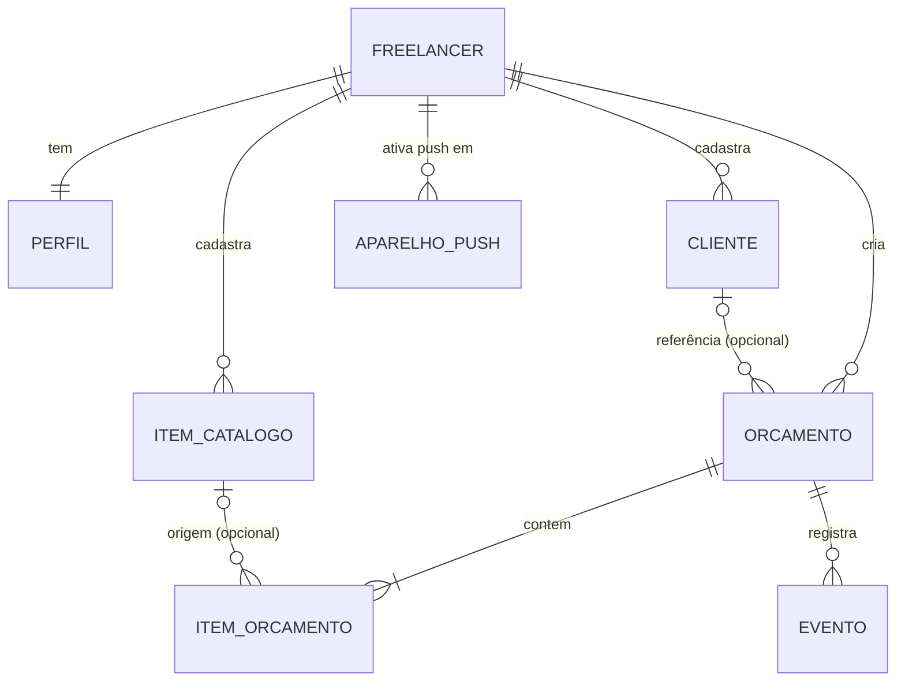
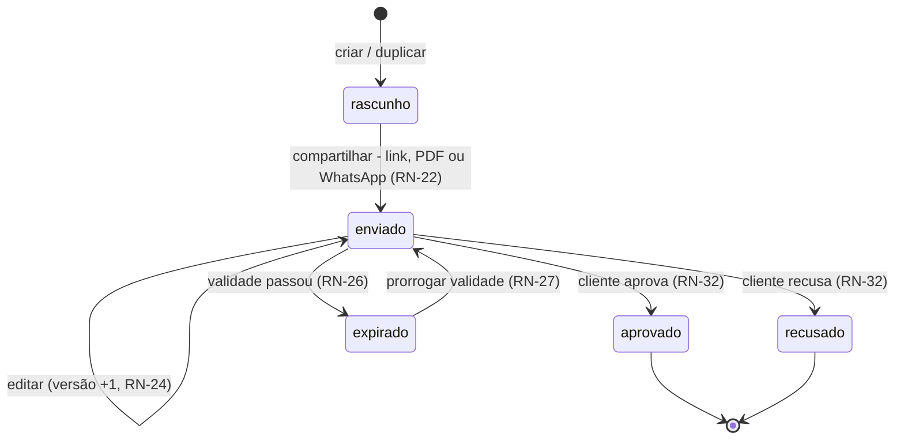

# 11 — Mapa do negócio

> Status: rascunho para validação · Última atualização: 2026-09-27

## Atores

| Ator | Autenticado? | O que faz |
|---|---|---|
| **Freelancer** | Sim | Gerencia perfil, clientes, catálogo e orçamentos; compartilha link/PDF; acompanha respostas. |
| **Cliente final** | Não | Abre o link, vê o orçamento, baixa o PDF, aprova ou recusa. |
| **Sistema** | — | Numera orçamentos, calcula totais, expira pela validade, registra eventos, aplica limites, envia notificações (e-mail e push) e lembretes diários. |

## Entidades e relações



- **Orçamento** guarda **cópia** dos dados do cliente (RN-20). A referência ao cliente serve para navegação e impede excluir um cliente com orçamentos (RN-09).
- **Item do orçamento** guarda **cópia** de descrição, unidade e preço. A origem no catálogo permite atualizar rascunhos quando o item muda (RN-11).
- **Evento**: visualizado, aprovado, recusado (RN-34, RN-35).

Modelo físico em [05-dados.md](05-dados.md).

## Máquina de estados do orçamento



| Status (UI) | Valor técnico | Editável? | Link público | Cliente pode responder? |
|---|---|---|---|---|
| Rascunho | `draft` | Sim | Não funciona | — |
| Enviado | `sent` | Sim | Funciona | Sim |
| Aprovado | `approved` | Só anotações internas | Funciona (mostra resultado) | Não |
| Recusado | `rejected` | Só anotações internas | Funciona (mostra resultado) | Não |
| Expirado | `expired` (derivado) | Só a validade | Funciona (avisa que expirou) | Não |

## Mapa de telas (sitemap)

URLs em pt-BR, visíveis ao usuário.

```
Público (sem login)
├── /                         Landing focada no problema (NBB-97): topo, o problema, como funciona, o que o cliente recebe, benefícios, perguntas, "Começar grátis" e "Entrar" (logado → /app/orcamentos)
├── /entrar                   Login (e-mail+senha, Google)
├── /cadastro                 Cadastro (e-mail+senha, Google)
├── /recuperar-senha          Pedir link de redefinição (aviso se o link venceu)
├── /redefinir-senha          Definir nova senha (via link do e-mail) → /entrar
├── /termos                   Termos de uso
├── /privacidade              Política de privacidade
├── /experimentar             Demonstração sem conta: mini editor → como o cliente recebe (nada é gravado; M8, NBB-95)
└── /p/[token]                Orçamento para o cliente final: ver, PDF, Aprovar/Recusar

App (logado) — barra fixa com botão "Novo orçamento"
├── /app                      → redireciona para /app/orcamentos
├── /app/orcamentos           Lista com filtro por status + busca (tela inicial)
├── /app/orcamentos/novo      Cria rascunho e abre o editor
├── /app/orcamentos/[id]      Editor / visualização; prévia, copiar link, baixar PDF, WhatsApp, duplicar, excluir
├── /app/clientes             Lista + busca + criar/editar em painel
├── /app/catalogo             Lista + busca + criar/editar em painel
└── /app/perfil               Perfil, logo, padrões, sair, excluir conta

Técnico
├── /api/auth/*               Rotas do Better Auth: links dos e-mails de conta (confirmação, recuperação) e retorno do Google
├── /api/orcamentos/[id]/pdf  PDF (dono) · /api/p/[token]/pdf (cliente final)
├── /api/cron/diario          Tarefas diárias: lembrete de vencimento e anonimização dos IPs (POST; cron da VPS, protegido por segredo)
├── /robots.txt, /sitemap.xml Buscadores: só a landing, /termos e /privacidade (staging: nada)
├── /opengraph-image          Imagem de prévia do link da landing (gerada no build; só no /)
├── /manifest.webmanifest     Manifesto do PWA
└── /sw.js                    Service worker (recebe push; sem cache offline)
```

Navegação principal (NBB-41):
- **Celular:** barra inferior com **Orçamentos · Clientes · Catálogo · Perfil** e botão flutuante **+ Novo orçamento**.
- **Tablet e computador:** barra no topo com o logo, os mesmos 4 itens e o botão **+ Novo orçamento**.
- O item da página atual fica com a cor da marca. Telas ainda não construídas mostram "Em breve".

Quem já está logado e abre `/entrar` ou `/cadastro` vai direto para `/app/orcamentos`. Sem login, qualquer página do `/app` manda para o `/entrar`.

## Glossário

| Termo | Significado |
|---|---|
| **Orçamento** | Proposta de preço enviada pelo freelancer ao cliente final. |
| **Rascunho** | Orçamento ainda não compartilhado. |
| **Enviado** | Orçamento já compartilhado (link copiado, PDF baixado ou WhatsApp aberto). A prévia não conta. |
| **Aprovado / Recusado** | Resposta definitiva do cliente pelo link. |
| **Expirado** | Enviado cuja validade passou sem resposta. |
| **Validade** | Última data em que o cliente pode responder. |
| **Catálogo** | Lista de produtos/serviços reaproveitáveis do freelancer. |
| **Snapshot / cópia** | Dados de cliente e itens gravados dentro do orçamento, imunes a edições posteriores. |
| **Link público / token** | URL secreta e não-adivinhável que dá acesso ao orçamento sem login. |
| **Versão** | Contador interno de edições após o envio (RN-24). |
| **Condições de pagamento / prazo** | Como o cliente paga e em quanto tempo o serviço é entregue (RN-44). Diferente dos "dados de pagamento" do perfil (para onde pagar). |
| **PWA** | Site que pode ser instalado na tela inicial e aberto como app. |
| **Push** | Notificação que aparece no aparelho mesmo com o app fechado (RN-45). |
